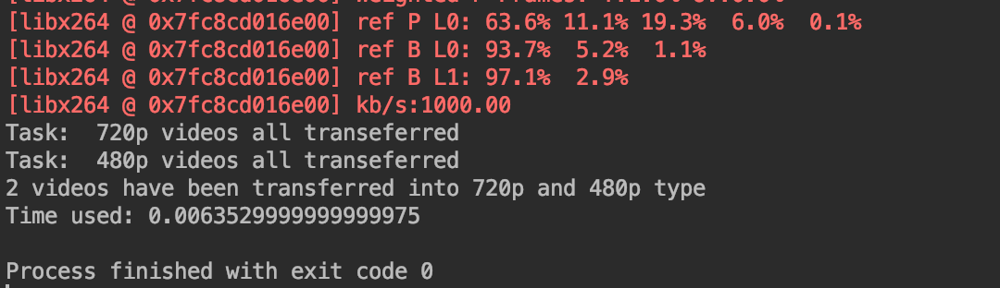

# python-CI-template
Python CI template for EC500 Software Engineering

I use a queue to stpre all the mp4 files stored in the path, and then use two async functions to transefer the video into 480p and 720p seperately. Finally use a task array to run the functions.

As for the test file, I store the media metadata and compare its arigin and after transferred version as the judgement factor.

The transfer result is as followed:

